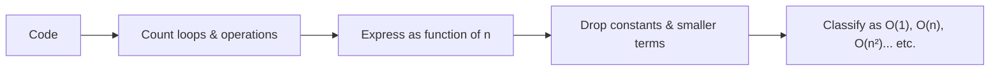
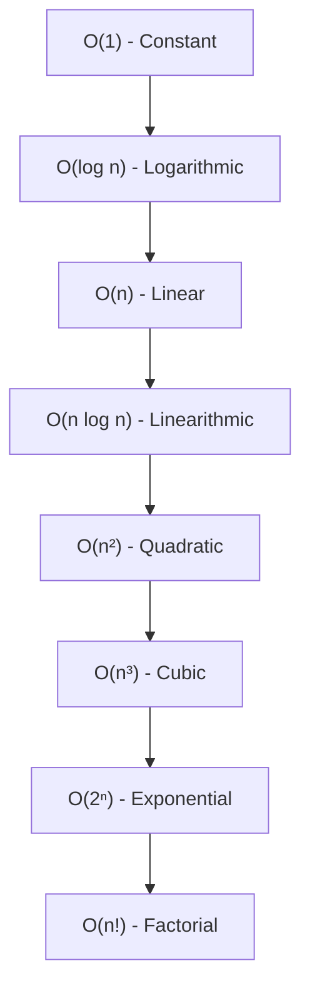

# Time and Space Complexity

## 🎯 Learning Goal

By the end of this note, I will understand what time complexity and space complexity mean, why interviewers love asking about them, the different types (Best/Average/Worst case), the standard complexity classes (O(1), O(n), O(n²), O(log n), etc.), and how to quickly eyeball code to figure out its complexity.

---

## 🤔 What is it?

**Time Complexity** = a way to describe how the *running time* of your code grows as the input size (`n`) grows. It does NOT measure exact seconds — it measures how the number of operations scales.

**Space Complexity** = a way to describe how much *extra memory* your code needs as the input size (`n`) grows.

> 🧸 Think of it like packing for a trip. Time complexity is "how long will packing take if I have more clothes?" Space complexity is "how big a suitcase do I need if I have more clothes?" Both grow with the amount of stuff (`n`), but they measure different things (time vs. space).

We don't measure complexity in actual seconds/MBs because that depends on the computer's speed. Instead, we measure it in terms of **how the work grows relative to input size** — this is called **Asymptotic Notation**.

### Asymptotic Notation
- Best Case (ω)
- Average Case (θ)
- Worst Case (O)

```python
Examples:
n = 10
x = 3

for i in range(n):
    if i == x:
        break
    print(i, end=" ")

x = n
for i in range(n):
    if i == x:
        break
    print(i, end=" ")


# best case    -> 1 operation   -> Ω(1)
# average case -> n/2 operations -> θ(n)
# worst case   -> n operations   -> O(n)
```


---

## ❓ Why do we need it?

- Two pieces of code can produce the same output, but one might be way slower or use way more memory as `n` grows huge (like 1 million items).
- Without complexity analysis, you can't predict if your code will crash/hang on large inputs until it's too late.
- **Interviewers ask about it because**: it tests whether you can look at code and reason about *scalability*, not just "does it work on my small test case." A solution that works instantly for 10 items but takes 10 minutes for 10 million items is a red flag in real-world systems (think: a search engine, a database, a social media feed).

---

## 🧠 Key Idea

- Complexity is always described in terms of input size `n`.
- We care about **growth rate**, not exact operation count — constants and small additions are ignored (e.g., `O(n + 10)` is just `O(n)`).
- There are 3 "cases" to describe performance: **Best, Average, Worst**.
- Nested loops usually multiply complexity; sequential loops usually add (and then simplify).
- Space complexity counts **extra memory used**, not the input itself (usually).

---

## 📚 Important Terms

| Term | Simple Meaning | Example |
|------|----------------|----------|
| Time Complexity | How the runtime grows as input grows | Looping through a list once → grows linearly |
| Space Complexity | How extra memory usage grows as input grows | Creating a new list of size `n` → grows linearly |
| Asymptotic Notation | Math notation to describe growth rate, ignoring constants | O(n), O(1), O(n²) |
| Big O — O() | **Worst case** — the maximum time/space it could ever take | Searching for a missing item in a list |
| Big Omega — Ω() | **Best case** — the minimum time/space it could take | Finding the item on the very first try |
| Big Theta — θ() | **Average case** — the "typical" expected time/space | Finding the item somewhere in the middle |
| `n` | The size of the input (list length, string length, etc.) | If a list has 10 items, `n = 10` |
| Constant Time | Doesn't grow at all, no matter the input size | Accessing `list[0]` |
| Linear Time | Grows directly proportional to input | One `for` loop over `n` items |
| Quadratic Time | Grows as the square of input | Two nested loops over `n` items |
| Logarithmic Time | Grows very slowly — input keeps getting cut in half | Binary search |

---

## 🔄 How it Works



**Steps explained in simple language:**
1. **Identify Loops** — Look at the code and count how many times things repeat (single loop, nested loop, loop that halves each time, etc.)
2. **Express as function of n** — Write down roughly how many operations happen, e.g. `n + n = 2n`, or `n * n = n²`.
3. **Simplify** — Big O only cares about the *biggest* growing term. Drop constants and smaller terms. `2n + 10` becomes just `O(n)`. `n² + n` becomes `O(n²)`.
4. **Classify** — Match it to a standard bucket: O(1), O(log n), O(n), O(n log n), O(n²), O(n³), O(2ⁿ), O(n!).

---

## 🌍 Real-Life Example

Imagine you're looking for your friend's name in a **phone contact list**:

- **Best Case (Ω)** — Your friend's name is the very first contact you check. Super fast!
- **Average Case (θ)** — Your friend's name is somewhere in the middle. You check about half the list.
- **Worst Case (O)** — Your friend's name is the last one, or not in the list at all. You had to check *everyone*.

This is exactly how interviewers frame Best/Average/Worst case — like checking a **library shelf** for a book (found instantly, found after some searching, or had to check every book).

---

## 💻 Technical Example

From the notebook — a loop that searches for `x` and stops early using `break`:

```python
n = 10
x = 3

for i in range(n):
    if i == x:
        break
    print(i, end=" ")
# Output: 0 1 2

x = n  # not found in range, worst case
for i in range(n):
    if i == x:
        break
    print(i, end=" ")
# Output: 0 1 2 3 4 5 6 7 8 9
```

- **Best case (Ω(1))** — `x` is found on the very first check (1 operation).
- **Worst case (O(n))** — `x` is never found (or is the last element), so the loop runs `n` times.
- **Average case (θ(n/2))** — `x` is typically found somewhere in the middle, so roughly half the loop runs. (We still simplify θ(n/2) down to θ(n) when writing final complexity, since constants like `/2` are dropped.)

---

### Common Complexity Classes (with code from the notebook)

**1. Constant Time — O(1)**
The number of operations does NOT depend on `n`. Even with a fixed loop of 50, it's still constant because it never changes with input size.
```python
for i in range(50):
    print(i, end=" ")
```

**2. Linear Time — O(n)**
One loop through `n` items. Note: `range(n // 2)` and `range(n + 10)` are STILL O(n) — dividing or adding a constant doesn't change the growth *rate*, only the exact count.
```python
n = 10
for i in range(n):
    print(i, end=" ")

for i in range(n // 2):     # still O(n), just half the work
    print(i, end=" ")

for i in range(n + 10):     # still O(n), just +10 extra
    print(i, end=" ")
```

**3. Quadratic Time — O(n²)**
A loop inside a loop, each running `n` times → `n * n = n²` total operations.
```python
n = 10
for i in range(n):
    for j in range(n):
        print(i, j, end=" ")
```
(Note: `range(n**2)` by itself is NOT nested loops — it's just one loop that happens to run `n²` times. Same complexity class, different code shape.)

**4. Logarithmic Time — O(log n)**
The input is **cut in half (or doubled)** each step instead of moving one at a time. This is what makes it so fast even for huge `n`.
```python
n = 100
while n > 0:
    print(n, end=" ")
    n //= 2          # halving each time: 100 → 50 → 25 → 12 → 6 → 3 → 1

i = 1
n = 100
while i <= n:
    print(i, end=" ")
    i *= 2           # doubling each time: 1 → 2 → 4 → 8 → 16 → 32 → 64
```

**5. Linearithmic Time — O(n log n)**
An outer loop that runs `n` times, combined with an inner "halving/doubling" loop (like log n). Common in efficient sorting algorithms (Merge Sort, Quick Sort).
```python
for i in range(n):
    while i <= n:
        print(i, end=" ")
        i *= 2
```

**6. Cubic Time — O(n³)**
Three nested loops (or a loop with a step that multiplies work three levels deep).

**7. Factorial Time — O(n!)**
Grows explosively — used for problems that try *every possible ordering* (e.g. Traveling Salesman brute-force, permutations).

---

## 🖼 Visual Representation

```
Fast  ────────────────────────────────────────────────►  Slow
O(1)  <  O(log n)  <  O(n)  <  O(n log n)  <  O(n²)  <  O(n³)  <  O(2ⁿ)  <  O(n!)
```



---

## ⚖ Comparison

| Complexity | Name | Example Code Shape | Grows... |
|-----------|------|---------------------|----------|
| O(1) | Constant | Access `list[0]` | Never (flat) |
| O(log n) | Logarithmic | Halving/doubling loop | Very slowly |
| O(n) | Linear | Single loop | Proportionally |
| O(n log n) | Linearithmic | Loop + halving loop | A bit faster than n² |
| O(n²) | Quadratic | Nested loop (2 levels) | Squares |
| O(n³) | Cubic | Nested loop (3 levels) | Cubes |
| O(n!) | Factorial | Try every permutation | Explodes |

| Best Case (Ω) | Average Case (θ) | Worst Case (O) |
|----------------|-------------------|------------------|
| Minimum possible operations | Typical/expected operations | Maximum possible operations |
| e.g. found on 1st try | e.g. found in the middle | e.g. found last / not found |

---

## 💡 Easy Trick to Remember

> 📌 **"BAW"** — Best, Average, Worst = **Ω, θ, O** (in alphabetical-ish order of Greek letters: Omega, Theta, Oh — but remember **O is always Worst Case**, since that's the one we use 99% of the time in interviews.)

> 📌 **Nested loops multiply, sequential loops add (then simplify).** Two nested `for` loops of `n` → **multiply** → O(n²). Two separate back-to-back `for` loops of `n` → **add** → O(n + n) = O(2n) → simplify → O(n).

> 📌 **Halving = log.** Anytime you see a loop variable getting divided or multiplied (like `n //= 2` or `i *= 2`), think **O(log n)** immediately.

---

## ⚠ Common Misconceptions

❌ Time complexity tells you the exact number of seconds a program takes.
✅ It only tells you how the running time *scales* as input grows — actual seconds depend on hardware.

❌ `O(n + 10)` is different from `O(n)`.
✅ Constants are dropped. `O(n + 10)` simplifies to `O(n)` because as `n` grows huge, the `+10` becomes irrelevant.

❌ More loops always means worse complexity.
✅ Two loops **one after another** (not nested) just add up: O(n) + O(n) = O(n), not O(n²). Only **nested** loops multiply.

❌ Big O is the only notation that matters.
✅ Big O (worst case) is the most commonly used in interviews, but Ω (best) and θ (average) also matter for full understanding.

---

## 🔍 Interview Questions

- What is time complexity and why does it matter?
- What is the difference between Big O, Big Omega, and Big Theta?
- Why do we drop constants when calculating Big O (e.g. why is O(2n) just O(n))?
- What's the time complexity of two nested loops, each running `n` times?
- What's the time complexity of a loop where the variable is halved each iteration? Why?
- What is space complexity, and how is it different from time complexity?
- Give an example of an O(1), O(n), and O(n²) operation.
- Why is O(n log n) considered efficient for sorting algorithms?

---

## 📝 Quick Revision

- Time complexity = how runtime scales with input size `n`.
- Space complexity = how extra memory usage scales with input size `n`.
- Big O (O) = Worst case — the one most commonly asked in interviews.
- Big Omega (Ω) = Best case.
- Big Theta (θ) = Average case.
- Constants and smaller terms are dropped when simplifying (e.g. `O(n + 10)` → `O(n)`).
- Nested loops **multiply** complexity; sequential loops **add** (then simplify).
- A loop that halves/doubles its counter each step is **O(log n)**.
- Growth order from fastest to slowest: O(1) < O(log n) < O(n) < O(n log n) < O(n²) < O(n³) < O(2ⁿ) < O(n!).
- Space complexity counts extra memory created (like a new list), not just the input itself.

---

## 🎓 Cheat Sheet

| Concept | One-Line Meaning |
|----------|------------------|
| Time Complexity | How runtime grows with input size |
| Space Complexity | How memory usage grows with input size |
| O (Big O) | Worst case scenario |
| Ω (Big Omega) | Best case scenario |
| θ (Big Theta) | Average case scenario |
| O(1) | Constant — never changes with `n` |
| O(log n) | Logarithmic — input halved/doubled each step |
| O(n) | Linear — one pass through input |
| O(n log n) | Linearithmic — loop + halving loop |
| O(n²) | Quadratic — nested loop, 2 levels |
| O(n³) | Cubic — nested loop, 3 levels |
| O(n!) | Factorial — tries every possible ordering |

---

## 📖 Related Topics

Since this topic is **Time and Space Complexity**, next recommended topics:

- Arrays and Lists (how operations like append/search have different complexities)
- Searching Algorithms (Linear Search vs Binary Search)
- Sorting Algorithms (Bubble Sort vs Merge Sort — comparing their complexities)
- Recursion and Recurrence Relations
- Data Structures (Stack, Queue, Hash Map) and their operation complexities

---

## ✅ Key Takeaways

1. Time complexity measures how runtime **scales** with input size `n`, not exact seconds.
2. Space complexity measures how **extra memory usage** scales with input size `n`.
3. Big O (worst case) is the most important for interviews, but Ω (best) and θ (average) complete the picture.
4. **Nested loops multiply** complexity (O(n²)); **sequential loops add then simplify** (still O(n)).
5. A loop that **halves or doubles** its variable each step is a strong sign of **O(log n)**.
